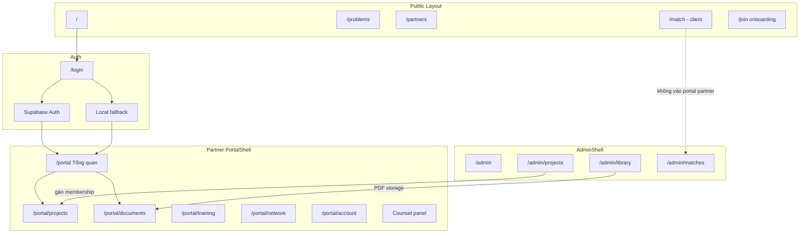

# Rà soát luồng + tư vấn Dashboard “xịn hơn”

**Ngày:** 2026-07-14  
**Phạm vi:** Public network · Login/Auth · Partner portal · Admin · PDF · Match  

---

## 1. Bản đồ luồng hiện tại



### Smoke route (localhost)

Tất cả route chính trả **HTTP 200** (SPA).

---

## 2. Chấm điểm từng luồng

| Luồng | Trạng thái | Điểm | Ghi chú |
|-------|------------|------|---------|
| **Public discovery** | OK demo | 7/10 | Problem-first; copy còn EN/VI lẫn |
| **Onboarding /join** | OK demo | 6/10 | Enrichment LinkedIn partial |
| **Login Auth** | Khó vận hành | 5/10 | Rate limit; local fallback đã có |
| **Login → Portal shell** | OK visual | 8/10 | Phase A–C executive |
| **Dashboard priority** | OK logic | 7.5/10 | Từ milestone; thiếu deep-link mốc |
| **Engagement list** | OK | 7/10 | Chưa detail `/projects/:id` |
| **PDF library** | OK khi Auth | 7/10 | Local fallback không đọc Storage |
| **Năng lực / Standing** | UI OK | 6/10 | Training tĩnh; standing partial |
| **Hệ sinh thái** | Mỏng | 5/10 | Chỉ hub ra public |
| **Admin projects** | Demo CRUD | 7/10 | Membership + status |
| **Admin match** | Seed UI | 5/10 | Không nối portal partner |
| **Bảo mật route** | Yếu | 3/10 | `/portal` `/admin` **không guard** |
| **Nexus Counsel** | Demo/live | 6/10 | Chưa gắn action trên dashboard |

---

## 3. Lỗ hổng luồng (ưu tiên fix kỹ thuật)

### P0 — Tin cậy & an toàn
1. **Không route guard** — ai cũng mở `/portal`, `/admin` không login.  
2. **Hai mode data** (Auth vs local) — partner local thấy empty PDF / empty RLS projects → cảm giác “hỏng”.  
3. **Engagement không có trang chi tiết** — CTA “Vào phòng” chỉ list.  
4. **Search header** không hoạt động.  

### P1 — Sâu nghiệp vụ
5. Priority không deep-link `?highlight=milestone`.  
6. Training tĩnh — không gate “đạt chuẩn trước engagement”.  
7. Counsel không nhận context engagement đang mở.  
8. Onboarding submit không nối Admin approval → tạo project.  

### P2 — Polish
9. Public `/me/*` còn shell khác portal.  
10. Admin UI chưa đồng bộ aesthetic executive.  
11. Match form public còn EN lẫn.  

---

## 4. Tư vấn Dashboard “xịn hơn” (product + UX)

Triết lý: **Command center cho 1 người lãnh đạo**, không control panel SaaS.

### 4.1 Nguyên tắc (giữ / siết)

| Nên | Không nên |
|-----|-----------|
| 1 ưu tiên + 1 CTA | 4–8 KPI đồng đều |
| Engagement narrative | List ID kỹ thuật lộ liễu |
| Time-aware (hôm nay / trễ) | Checklist onboarding junior |
| Verified standing | Badge “demo membership” |
| Counsel gắn context | Chat widget rời |

### 4.2 Cấu trúc dashboard đề xuất v2 (nâng từ Phase C)

```
┌─ HERO (dark) ─────────────────────────────────────┐
│ Verified · Region · Layer tags                     │
│ Greeting + Full name                               │
│ Ưu tiên hôm nay (milestone-backed)                 │
│ [Primary CTA: Làm việc này]  [Secondary: Counsel]  │
└────────────────────────────────────────────────────┘
┌─ HÔM NAY (60%) ──────────┬─ SIGNAL (40%) ─────────┐
│ Engagement primary card  │ Lịch 7 ngày (mốc)      │
│ Timeline 3 mốc ngang     │ Counsel chip context   │
│ File liên quan 1–2 PDF   │ Facilitator contact    │
└──────────────────────────┴────────────────────────┘
┌─ STANDING strip (1 hàng) ─────────────────────────┐
│ Layers · Member since · Trust score qualitative   │
└────────────────────────────────────────────────────┘
```

**Bỏ hoặc thu nhỏ:** block “Tài liệu curated” 3 item nếu trùng docs; gộp vào engagement “file cần đọc cho mốc này”.

### 4.3 Năm nâng cấp “cảm giác xịn” (ROI cao)

#### 1) **Phòng engagement** (`/portal/projects/:id`)
- Timeline, mốc clickable, brief PDF gắn project, updates log, “Next call”.  
- Dashboard CTA → **đúng mốc**, không list chung.  
→ Đây là thứ lãnh đạo trả tiền để dùng hàng ngày.

#### 2) **“Hôm nay” calendar strip**
- 7 ngày tới: chấm mốc due (từ `project_milestones.due_date`).  
- Trễ = terracotta; hôm nay = gold.  
→ Cảm giác private office, không LMS.

#### 3) **Counsel contextual**
- Nút hero: “Hỏi Counsel về [tên engagement]”.  
- Pre-fill Nexus memory: project id, next milestone, blockers.  
→ AI = senior advisor, không chatbot trang trí.

#### 4) **Trust / Standing card editorial**
- Ảnh/avatar thật (từ onboarding), tầng T, industries, “Trusted by 3HORIZONS since”.  
- Không hiện `partnerId` slug kỹ thuật trên dashboard (để hồ sơ).  

#### 5) **Mode honesty**
- Banner local: 1 dòng + “Kết nối Auth để PDF & dữ liệu live”.  
- Empty PDF: CTA rõ “Cần phiên Auth” không “lỗi mơ hồ”.  
→ Xịn = minh bạch, không pretend production khi đang demo.

### 4.4 Microcopy / language (siết thêm)

| Hiện | Đề xuất |
|------|---------|
| Collaboration (EN) | **Engagement** (VI nhất quán) |
| `col-310` lộ hero | Chỉ trong meta nhỏ / admin |
| “Nguồn: local/supabase” | Ẩn với partner; chỉ dev/staff |
| “Mở engagement chính” | **Tiếp tục: [tên mốc]** |

### 4.5 Visual depth (không redesign lớn)

- Hero: bớt grid noise; 1 light line gold đủ.  
- Typography scale: hero 36–40, body 15–16 cho priority.  
- Mobile: hero full-bleed, 1 CTA, quyết định 2 dòng max.  
- Dark mode **không** cần — cream/espresso đã là brand signature.  

### 4.6 Metrics “xịn” nếu có data (sau)

Không KPI vanity. Chỉ:
- **Mốc đúng hạn %** (engagement active)  
- **Thời gian phản hồi brief** (partner)  
- **Engagement health**: on track / at risk / paused  

Hiển thị qualitative: “Đúng nhịp” / “Cần chú ý” — không chart 7 màu.

---

## 5. Roadmap 3 sprint gợi ý

| Sprint | Deliverable | Outcome |
|--------|-------------|---------|
| **S1** | Route guard + mode banner + project detail page | **Đã ship 2026-07-14** |
| **S2** | Dashboard v2: calendar 7d + CTA mốc + Counsel context | Cảm giác command center |
| **S3** | PDF gắn engagement + training gate + standing avatar | Depth vận hành |

---

## 6. Kết luận ngắn

**Đã có:** shell executive, priority từ mốc, standing, PDF storage, tách match khỏi partner.  

**Còn làm dashboard “xịn” thật:**
1. **Deep engagement room** (không chỉ list)  
2. **Time surface** (7 ngày / trễ hạn)  
3. **Counsel gắn engagement**  
4. **Guard + honesty mode** (Auth vs local)  
5. **Bớt chrome kỹ thuật** trên mặt partner  

---

*Tài liệu kèm: `portal-executive-ux-plan.md`, `pdf-storage.md`, `supabase-setup.md`.*
