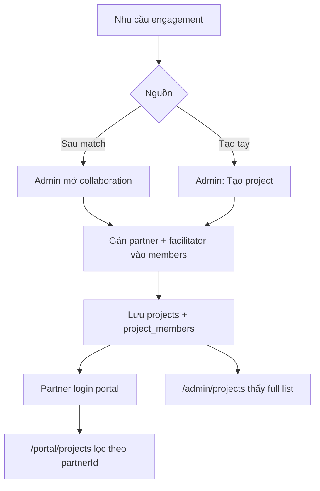

# Partner projects — thêm, Admin, bảo mật

**Scope:** `/portal/projects` (đối tác) + `/admin/projects` (3HORIZONS staff)  
**Demo store:** `apps/web/src/data/projects-store.ts` (localStorage)  
**Demo session:** `apps/web/src/lib/session.ts`

---

## 1. Nguyên tắc nghiệp vụ

| Ai | Được làm gì |
|----|-------------|
| **Partner** | Chỉ **xem** project mình được gán (membership). Không tự tạo project. Không gửi match. |
| **Admin / Partner Manager / Project Operator** | Tạo project, gán/gỡ partner, đổi status, xem **tất cả**. |
| **Khách / matching desk** | Gửi match (public `/match`) — sau đó staff mở collaboration. |

Partner **không** dùng form matching. Project xuất hiện sau khi 3HORIZONS **gán membership**.

---

## 2. Luồng thêm project



### Demo (localhost)

1. Mở **http://localhost:5173/admin/projects**
2. **Tạo project** → chọn partner (VD: Lan Phạm) → submit  
3. Mở **http://localhost:5173/login** → chọn persona **Lan Phạm**  
4. Vào **/portal/projects** → thấy project vừa tạo  
5. Đăng nhập **Cuong Doan** → **không** thấy project của Lan (trừ khi cũng được gán)

### Seed mặc định (membership)

| Project ID | Title | Partner members | Status |
|------------|-------|-----------------|--------|
| `col-310` | Kích hoạt đối tác 3HVN | `cuong-doan` | active |
| `col-221` | Chuỗi workshop làm rõ chiến lược | `lan-pham` | active |
| `col-198` | Phục hồi thực thi — danh mục số | `erik-sundberg` | paused |
| `col-175` | Family council setup | `david-tran` | archived (ẩn portal) |

Reset seed: nút **Reset seed** trên Admin Projects (xoá `3h-projects-store-v1`).

---

## 3. Quản lý từ Admin (`/admin/projects`)

| Hành động | Demo | Production |
|-----------|------|------------|
| List + filter status | ✅ | ✅ |
| Tạo project + gán 1 partner | ✅ localStorage | INSERT `projects` + `project_members` |
| Gán / gỡ partner | ✅ | UPDATE members + audit |
| Đổi status active/paused/archived | ✅ | + RLS ẩn archived theo policy |
| Milestone / files / updates | Snapshot seed | Storage + realtime |
| Audit log | Chưa | Bắt buộc |

**Roles gợi ý (seed):**

- `super_admin` / `partner_manager` — tạo, gán, archive  
- `project_operator` — sửa milestone/files, hạn chế tạo  
- Partner — chỉ portal, membership filter  

---

## 4. Bảo mật giữa partner (multi-tenant)

### Mô hình

```
project_members (
  project_id,
  partner_id | user_id,
  role: partner | facilitator | client | owner
)
```

**Quy tắc portal:**

```
list = projects WHERE
  status != 'archived'
  AND EXISTS member (partner_id = session.partnerId AND role = 'partner')
```

| Actor | Thấy project A của partner khác? |
|-------|----------------------------------|
| Partner B | **Không** |
| Admin | Có (toàn bộ) |
| Anonymous | Không (production: bắt login) |

### Production (Supabase)

1. **Auth** — JWT; claim `partner_id` / `role`  
2. **RLS** — `SELECT` project chỉ khi `auth.uid()` ∈ `project_members`  
3. **Staff policies** — `is_staff()` bypass cho `/admin` APIs  
4. **Storage** — path `projects/{id}/…` + policy membership  
5. **Deep-link** — không member → **404** (không lộ tồn tại)  
6. **Không tin client** — `partner_id` lấy từ session, không từ query string  

### Demo limits (quan trọng)

| Hạng mục | Demo | Production |
|----------|------|------------|
| Isolation | Filter client-side + localStorage | RLS server-side |
| Auth | Persona localStorage | Supabase Auth |
| Tamper | User có thể sửa localStorage | Không tin browser |
| Cross-user | Cùng browser profile | DB + JWT |

**Demo chỉ để walkthrough multi-tenant UX — không đủ production.**

---

## 5. Code map

| File | Vai trò |
|------|---------|
| `src/data/projects-store.ts` | Store + seed + create/assign + hooks |
| `src/lib/session.ts` | Demo partner session / personas |
| `src/hooks/useDemoSession.ts` | React session hook |
| `src/pages/portal/PortalPages.tsx` → `ProjectsPage` | List filtered |
| `src/pages/portal/DashboardHome.tsx` | KPI + cards filtered |
| `src/pages/admin/AdminProjects.tsx` | CRUD demo membership |
| `src/pages/LoginPage.tsx` | Chọn persona isolation test |

Storage keys:

- `3h-projects-store-v1` — projects  
- `3h-demo-session-v1` — current partner identity  

---

## 6. Checklist nghiệm thu demo

- [ ] Login **Cuong Doan** → portal projects chỉ `col-310` (và project admin gán thêm cho `cuong-doan`)  
- [ ] Login **Lan Phạm** → chỉ `col-221` (+ gán thêm)  
- [ ] Login **Erik** → chỉ `col-198`  
- [ ] Admin tạo project gán Lan → Lan thấy ngay; Cuong không thấy  
- [ ] Gỡ partner khỏi membership → portal của họ mất project  
- [ ] Archive → portal ẩn (admin vẫn thấy trong filter)  

---

## 7. Next (production path)

1. Supabase schema `projects` + `project_members` + RLS policies  
2. Auth gate `/portal/*`  
3. Project detail `/portal/projects/:id` (files, updates)  
4. Audit log gán/gỡ partner  
5. Đồng bộ Nexus project memory với membership  

---

## 8. Assumptions / out of scope (demo)

- Không real-time multi-user server  
- Không file upload thật  
- Không billing theo project  
- Matching form vẫn public cho client — **không** trong partner portal  
