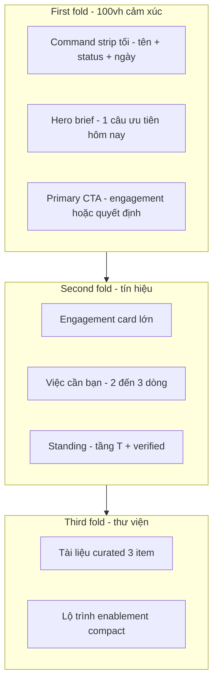

# Plan UX — Partner Portal cho lãnh đạo (đẳng cấp)

**Mục tiêu:** Khi partner (CEO / advisor / board-level) login `/portal`, cảm giác **private advisory workspace** — không SaaS admin bình thường, không “task board freelancer”.

**Phạm vi ưu tiên:** Shell + Dashboard home → Projects → Documents/Training polish.

---

## 1. Chẩn đoán: vì sao hiện tại “bình thường”

| Hiện trạng | Cảm giác lãnh đạo |
|------------|-------------------|
| KPI 4 ô “Việc / Dự án / Huấn luyện / Tài liệu” | Giống CRM / LMS generic |
| “Xin chào, {firstName}” + quick actions icon gradient | Startup SaaS, không private office |
| Task list checklist onboarding | Operational, junior |
| Sidebar “Bảng điều khiển” + demo chrome | Tool nội bộ, không club |
| Search / region / lang cosmetic | Noise, không tín hiệu |
| Cards border xám, shadow nhẹ, portal-50 | Clean nhưng **không memorable** |
| Copy “workspace đối tác… membership” | Kỹ thuật, không executive |

**Root cause:** UI đang **liệt kê tính năng**, chưa **kể câu chuyện vị thế + quyết định + tiến độ engagement**.

---

## 2. Persona & cảm xúc mục tiêu (30 giây đầu)

**Persona:** Partner đã verified — chiến lược gia, chuyên gia kế thừa, advisor HĐQT.  
**Cảm xúc:** *Tôi đang bước vào không gian chỉ định của 3HORIZONS — im lặng, rõ ràng, có trọng lượng.*

**Không phải:** dashboard KPI sặc sỡ, gamification, “streak học module”.

**Reference tinh thần (không copy UI):**

- Private banking / family office portals  
- Boutique strategy firm client rooms  
- Linear / Notion enterprise calm — nhưng ấm hơn (cream + espresso + gold 3H)

---

## 3. Nguyên tắc thiết kế (non‑negotiable)

1. **Signal over chrome** — 1 hero moment, 2–3 khối chính; ẩn demo noise.  
2. **Editorial hierarchy** — Be Vietnam Pro display lớn; Inter body; tracking rộng cho label.  
3. **Quiet luxury** — ít gradient ồn; 1 accent gold/terracotta; navy sâu.  
4. **Decision language** — “Việc cần bạn quyết”, “Engagement đang dẫn dắt”, không “tasks open”.  
5. **Presence of brand** — motto / layer T1–T7 subtle; không logo lặp.  
6. **Time respect** — “Hôm nay · 1 việc”, “Tuần này · 1 mốc” — không 12 widget.  
7. **Nexus = senior counsel** — panel gọn, không chat bubble đồ chơi.  
8. **Verified status** — badge “Verified Partner · Việt Nam” như thẻ thành viên.

---

## 4. Kiến trúc màn hình sau login



### 4.1 Shell (toàn portal)

| Element | Hướng mới |
|---------|-----------|
| Background | `cream-50` / subtle paper grain **hoặc** soft navy edge — **không** flat `#f4f6fb` admin |
| Sidebar | Tối (espresso/navy) **hoặc** cream + divider mảnh; label “Private workspace”; item ngắn: *Tổng quan · Engagement · Tài liệu · Năng lực · Hệ sinh thái · Hồ sơ* |
| Header | Bỏ region/lang nếu chưa i18n; search thu nhỏ hoặc command palette `⌘K`; avatar + **Verified** |
| Demo banner | Chỉ env dev, 1 dòng micro, không chiếm “executive height” |
| Nexus | Nút “Counsel” / “Nexus” mảnh; panel glass + navy header |

### 4.2 Dashboard home — wireframe

```
┌─────────────────────────────────────────────────────────────┐
│  PRIVATE WORKSPACE · 3HORIZONS          [Verified Partner]  │
│  Chào buổi sáng, [Full Name]                                │
│  “Ưu tiên hôm nay: [1 câu từ project.nextAction]”           │
│                              [ Mở engagement chính → ]        │
├──────────────────────┬──────────────────────────────────────┤
│  ENGAGEMENT ĐANG DẪN │  VIỆC CẦN BẠN                         │
│  (1 card lớn)        │  · 2–3 dòng editorial                 │
│  progress strip      │  · due date typography nhỏ            │
│  next milestone      │                                      │
├──────────────────────┴──────────────────────────────────────┤
│  STANDING                                                    │
│  Tầng trọng tâm T1 · T6    |  Trusted since 2026  |  Region  │
├──────────────┬──────────────────────┬───────────────────────┤
│ Tài liệu     │ Năng lực             │ Counsel (Nexus teaser)│
│ 3 items      │ 1 progress elegant    │ 1 dòng + mở panel     │
└──────────────┴──────────────────────┴───────────────────────┘
```

**Bỏ / giảm:** 4 KPI đồng đều; 4 quick-action icon rainbow; task “Xong” lịch sử; progress bar LMS thô.

---

## 5. Ngôn ngữ & microcopy (VI)

| Cũ | Mới |
|----|-----|
| Bảng điều khiển | Tổng quan |
| Xin chào, Cuong | Chào buổi sáng / Chào buổi chiều, **Cuong Doan** |
| Workspace đối tác — membership | Không gian làm việc riêng trong mạng lưới chọn lọc |
| Việc đang mở | Việc cần bạn |
| Dự án được gán | Engagement |
| Huấn luyện | Năng lực & chuẩn mực |
| Mạng lưới đối tác | Hệ sinh thái |
| Thao tác nhanh | Lối tắt (tối đa 2, text link) |

Tone: **tôn trọng, ngắn, không marketing hype, không emoji.**

---

## 6. Hệ visual “đẳng cấp”

### 6.1 Palette portal (tinh chỉnh)

- Nền: cream warm `#faf8f4`  
- Surface: white 90% + hairline `espresso/8%`  
- Ink: espresso-900  
- Accent: gold-600 **mảnh** + terracotta chỉ CTA  
- Dark strip: navy-900 / portal-900 cho hero  
- Success: muted forest (đã có)

### 6.2 Typography

- Hero name: `font-display` 32–40px, tracking tight  
- Section: 11px uppercase tracking `[0.2em]` gold/espresso-500  
- Numbers: tabular, lớn nhưng **một** con số hero (không 4 KPI)

### 6.3 Motion

- 150–200ms fade/slide; **không** bounce  
- Progress: line thin 2px, gold fill

### 6.4 Density

- Max content width ~1120px  
- Spacing 8pt scale; section gap 40–48px  
- Cards: `rounded-2xl`, shadow soft một lớp

---

## 7. Nội dung thông minh (data → narrative)

| Block | Nguồn data | Rule |
|-------|------------|------|
| Ưu tiên hôm nay | `project.nextAction` active đầu tiên | 1 câu; empty → “Hồ sơ sẵn sàng — chờ engagement” |
| Engagement card | Supabase projects (membership) | 1 primary + link “Tất cả” |
| Việc cần bạn | Seed curated 2–3 **actionable** | Ưu tiên needs_info / due soon |
| Standing | profile layers + verified | Static demo OK phase 1 |
| Tài liệu | 3 curated | Editorial titles |
| Nexus teaser | fixed copy | “Hỏi counsel về engagement đang mở” |

---

## 8. Lộ trình triển khai

### Phase A — “First impression” (1–2 ngày) — **nên làm ngay**

1. Redesign `DashboardHome` theo wireframe (hero dark + engagement + việc cần bạn).  
2. Refine `PortalShell`: sidebar labels, bỏ region/lang, header gọn, verified chip.  
3. Microcopy VI executive.  
4. Ẩn/thu gọn demo banner khi `VITE_DATA_MODE=supabase`.  
5. Empty state sang trọng (không project).

### Phase B — “Room consistency” (2–3 ngày)

6. Projects / Documents / Training / Account cùng language + card system.  
7. Login → transition “Entering private workspace…”.  
8. Nexus portal variant: header “Nexus Counsel”, typography calm.

### Phase C — “Signal depth” (sau)

9. Real “priority of the day” từ milestones due.  
10. Standing từ profile Supabase.  
11. Subtle illustration / paper texture (brand-safe).  
12. Motion + print-quality PDF preview later.

---

## 9. Out of scope (phase A)

- Redesign Admin OS (giữ operational)  
- Matching UI (không thuộc partner)  
- Full EN i18n  
- Gamification / badges học module

---

## 10. Tiêu chí “đẳng cấp” (acceptance)

Lãnh đạo mở `/portal` trong 5 giây:

1. Biết **mình là ai trong mạng lưới** (verified + tên đầy đủ).  
2. Biết **việc quan trọng nhất hôm nay**.  
3. Thấy **engagement chính** (không list CRUD).  
4. Không thấy cảm giác “admin template / LMS”.  
5. Sẵn sàng bấm 1 CTA chính — không bị 8 nút cạnh tranh.

---

## 11. Rủi ro

| Rủi ro | Giảm |
|--------|------|
| Quá tối / luxury cliché | Giữ cream warm, gold mảnh |
| Thiếu data → hero trống | Empty state editorial có sẵn |
| Khác biệt shell vs public site | Logo + palette 3H thống nhất |

---

## 12. Quyết định cần bạn chốt (trước code)

| # | Lựa chọn | Đề xuất |
|---|----------|---------|
| 1 | Sidebar **tối** vs **cream** | Cream + hairline (ấm 3H) **hoặc** navy slim (club) — **đề xuất cream warm + dark hero** |
| 2 | Hero **full dark band** vs card trắng | **Dark band** first fold |
| 3 | Tên menu VI mới ngay? | Có (Tổng quan, Engagement…) |

---

## Quyết định đã chốt

1. **Sidebar cream ấm** + hero dark band (2026-07-14)  
2–3. Theo đề xuất: dark hero + menu VI (Tổng quan, Engagement…)  

**Phase A đã ship:** `DashboardHome`, `PortalShell`, `DemoModeBanner`, Nexus “Counsel”.

**Phase B đã ship (2026-07-14):**  
- Shared `components/portal/PortalUi.tsx` (header, card, progress, empty, pills)  
- Đồng bộ: Engagement, Tài liệu, Năng lực, Hệ sinh thái, Hồ sơ + subpages  
- Login partner: micro transition “Đang vào private workspace…”

**Phase C đã ship (2026-07-14):**  
- Ưu tiên hôm nay + “Việc cần bạn” từ mốc/engagement thật (`lib/priority.ts`)  
- Standing từ Supabase profiles/partners + fallback (`lib/standing.ts`)  
- Paper texture + motion `animate-portal-in/rise/fade`  
- Document preview editorial (demo print-style)  
- Migration `profile_standing` (region, focus_layers, verified, standing_status)
