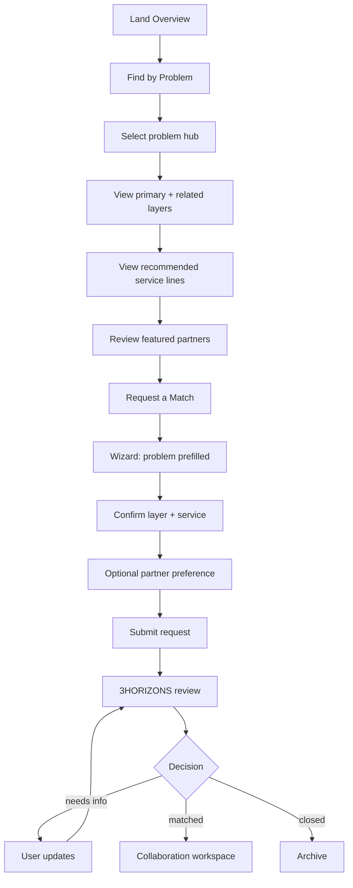
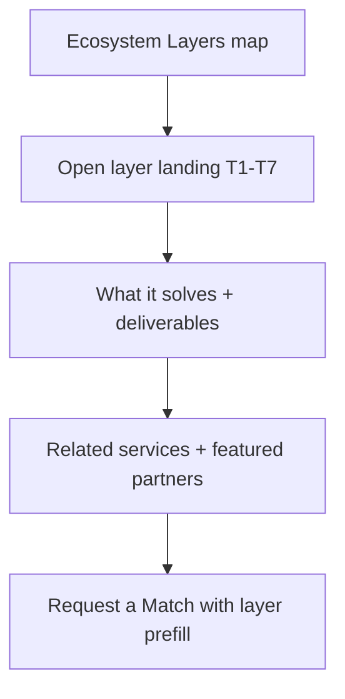
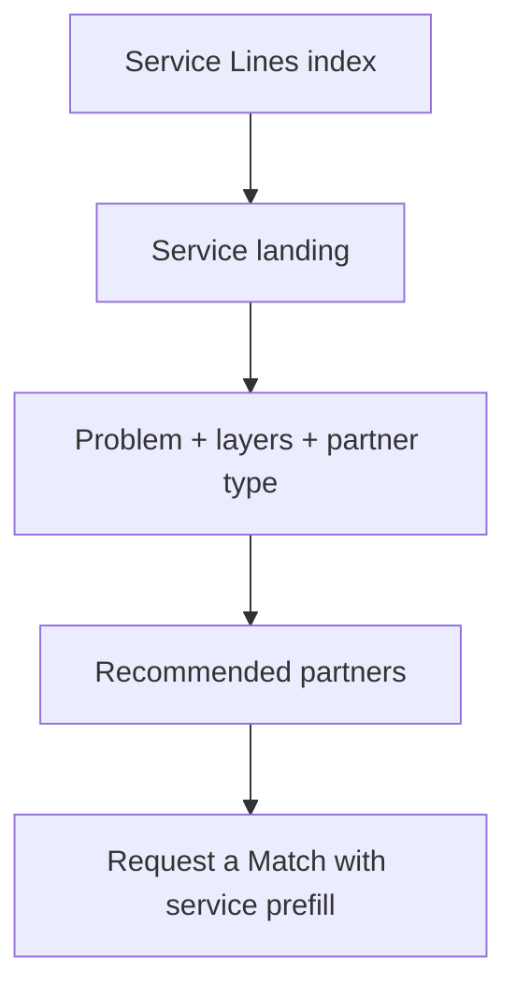
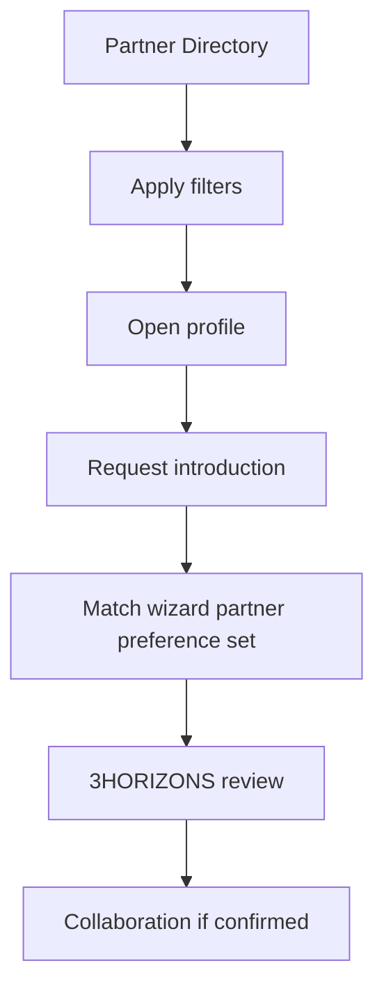
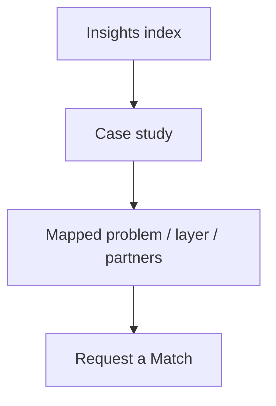
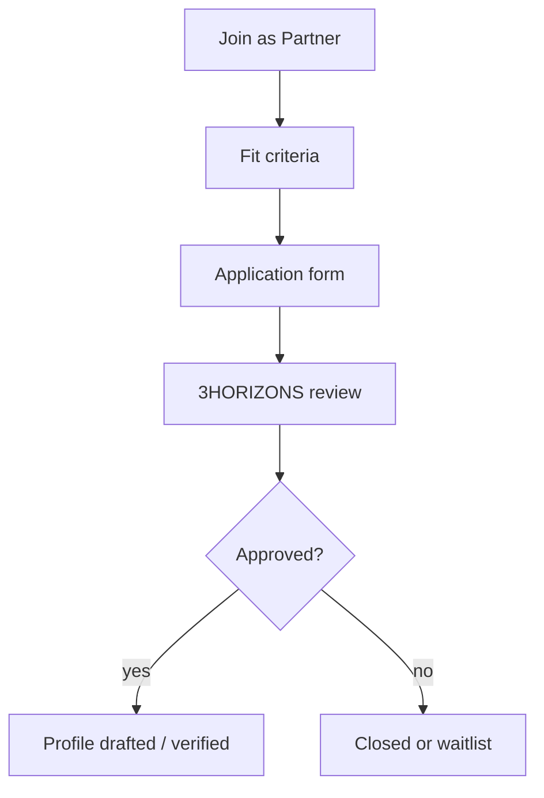
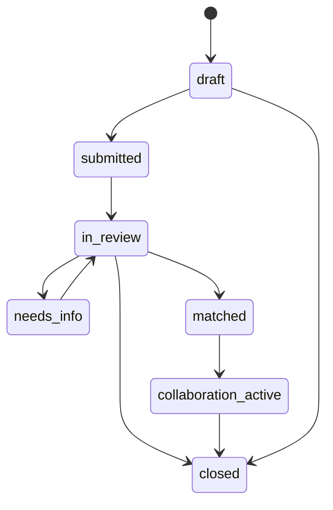

# User flows — 3HORIZONS Partner Network

**Version:** 1.0  
**Updated:** 2026-07-14

---

## Flow A — Problem-first match (primary)

**Acceptance:** User never needs to open Directory to complete a quality match.

---

## Flow B — Layer explorer

---

## Flow C — Service-led

---

## Flow D — Directory / known partner (secondary)

**Guardrail:** Profile CTA is “Request introduction”, not “Book / Hire now”.

---

## Flow E — Insights as trust entry

---

## Flow F — Join as partner (supply)

---

## Match status machine

